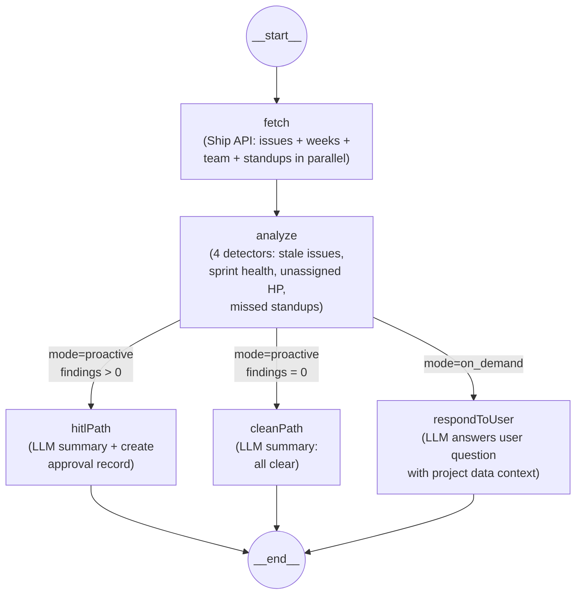

# FLEETGRAPH.md

## Agent Responsibility

FleetGraph is a project intelligence agent for Ship that monitors project execution quality and surfaces actionable findings backed by evidence. It operates in two modes through a single graph architecture:

**Proactive mode (agent pushes):**
- Monitors project state on a schedule (polling every 30 minutes during business hours)
- Runs 4 detectors: stale issues (no activity 3+ days), sprint health risks (too many open issues near sprint end), unassigned high-priority work, and missed standups
- Surfaces findings to the team with specific entity references (issue IDs, sprint names, assignee names)
- All findings pass through a human-in-the-loop approval gate before any downstream notification

**On-demand mode (user pulls):**
- Invoked from within Ship's UI via an embedded chat interface
- Context-aware: knows what page the user is viewing (issue, sprint, project, dashboard) and scopes its reasoning accordingly
- Answers questions like "What should I focus on today?", "What's blocking this sprint?", or "Who's overloaded?"
- Uses the same fetch → analyze → reason pipeline, but routes to a conversational response node instead of HITL gate

**Autonomous actions (no human needed):**
- Fetching data from Ship REST API
- Analyzing patterns and computing severity levels
- Generating summaries and answering chat questions
- Logging findings and creating approval records

**Requires human approval before:**
- Notifying team members about detected problems
- Reassigning work or changing sprint scope
- Escalating issues to leadership
- Any action that modifies Ship data or sends communications

**How on-demand mode uses context:**
- The `context` object carries `pathname`, `entityType`, and `entityId` from the user's current Ship view
- This context is injected into the LLM system prompt so the agent knows what the user is looking at
- Example: a user on `/projects/abc/sprints/123` triggers context `{entityType: "sprint", entityId: "123"}` — the agent focuses its answer on that sprint

---

## Graph Diagram



### Node Types

| Node | Type | Description |
|------|------|-------------|
| `fetch` | **Fetch** | Pulls issues, weeks, team members, and standups from Ship REST API in parallel via `Promise.all`. Standups fetched for active sprint only. |
| `analyze` | **Reasoning (rule-based)** | Runs 4 detectors: stale issues, sprint health, unassigned high-priority, missed standups. Computes aggregate severity. |
| `cleanPath` | **Action** | LLM summarizes the clean state. No approval needed. |
| `hitlPath` | **Action + HITL gate** | LLM summarizes findings. Creates an approval record that must be approved/rejected before any downstream notification. |
| `respondToUser` | **Reasoning (LLM)** | LLM answers the user's question using fetched Ship data as context. |

### Conditional Edges

| From | Condition | To |
|------|-----------|-----|
| `analyze` | `mode === "on_demand"` | `respondToUser` |
| `analyze` | `mode === "proactive" && findings.length > 0` | `hitlPath` |
| `analyze` | `mode === "proactive" && findings.length === 0` | `cleanPath` |

### State Schema

```typescript
{
  input: FleetRequestInput,   // mode, target, message?, context?
  issues: ShipIssue[],        // fetched from Ship API
  weeks: ShipWeek[],          // fetched from Ship API
  standups: ShipStandup[],    // fetched for active sprint
  teamMembers: ShipTeamMember[], // fetched from Ship API
  findings: Finding[],        // detected problems (4 categories)
  severity: Severity,         // "critical" | "warning" | "info" | "clean"
  summary: string,            // LLM-generated summary
  tracePath: string,          // "clean_path" | "hitl_path" | "on_demand_path"
  needsApproval: boolean,     // whether HITL gate was triggered
  approvalId?: string,        // UUID of approval record
  chatResponse?: string       // on-demand conversational answer
}
```

---

## Use Cases

| # | Role | Trigger | Agent Detects / Produces | Human Decides |
|---|------|---------|--------------------------|---------------|
| 1 | PM | Proactive (cron every 30 min) | Stale issues — open issues with no activity for 3+ days, lists specific issue titles and assignees | Whether to ping assignees or reprioritize |
| 2 | PM | Proactive (cron every 30 min) | Sprint health risk — too many open issues with < 3 days remaining in active sprint | Whether to cut scope, extend sprint, or reassign work |
| 3 | Engineer | On-demand (chat from dashboard) | "What should I focus on today?" — prioritized list of assigned issues by urgency and staleness | Which task to start working on |
| 4 | Director | On-demand (chat from project view) | Project health summary — open issue count, sprint progress, detected risks | Whether to escalate to leadership or intervene |
| 5 | PM | Proactive (cron every 30 min) | Unassigned high-priority issues — issues marked high/urgent/critical priority with no assignee, severity=critical | Whether to assign or defer |
| 6 | PM | Proactive (cron every 30 min) | Missed standups — team members who haven't submitted a standup for the active sprint, severity=info | Whether to nudge team members or ignore |

---

## Trigger Model

**Decision: Polling (cron-based)**

FleetGraph uses a polling trigger model — a cron job runs the proactive graph every **5 minutes** during business hours (Mon-Fri, 8am-6pm).

### Why polling?

| Approach | Pros | Cons |
|----------|------|------|
| **Polling (chosen)** | Simple to implement; works with any API; no Ship code changes needed; predictable cost; meets 5-min SLA | Redundant calls when nothing changed; higher cost than webhooks at scale |
| Webhook | Real-time detection; no wasted calls; lowest latency | Ship has no webhook system; would require Ship codebase changes; harder to deploy |
| Hybrid | Best of both worlds | Highest complexity; still needs Ship webhook support |

**Ship does not expose webhooks**, so polling is the only viable option without modifying the Ship codebase. A 5-minute poll interval meets the PRD's < 5-minute detection latency requirement:
- **Worst case:** event happens right after a poll → detected 5 minutes later ✅
- **Average case:** 2.5 minutes
- **Best case:** event happens right before a poll → detected immediately

### Detection latency analysis

| Metric | Value |
|--------|-------|
| Poll interval | 5 minutes |
| Worst-case detection latency | 5 minutes |
| Average detection latency | 2.5 minutes |
| Graph execution time (measured) | ~2-4 seconds |
| Ship API response time (measured) | ~50-200ms per call |
| Total worst-case surface time | ~5 min 4 sec |

### Cost at scale

| Scale | Proactive runs/day | On-demand runs/day | Total runs/day | Est. LLM cost/day |
|-------|--------------------|--------------------|----------------|--------------------|
| 1 workspace (MVP) | ~120 | ~50 | ~170 | ~$0.10 |
| 100 projects | ~28,800 | ~500 | ~29,300 | ~$17.60 |
| 1,000 projects | ~288,000 | ~5,000 | ~293,000 | ~$176.00 |

Assumptions: 120 polls/day per project (every 5 min × 10 hours business hours), ~1K tokens per run at GPT-4o-mini pricing ($0.15/$0.60 per 1M tokens). Cost per run: ~$0.0006.

**Cost cliff:** At 1,000 projects, LLM cost reaches ~$176/day (~$5,280/month). Mitigation strategies (first one is implemented):
- ✅ **Diff-based polling (implemented):** SHA-256 hash of fetched Ship data is cached per target. If the hash matches the previous poll, the LLM step is skipped entirely. This saves ~80% of LLM costs during quiet periods — only ~5 out of 120 daily polls typically need LLM processing.
- Increase interval to 15 min for low-priority projects
- Use cheaper model for triage, full model only when findings detected

### Configuration

```
ENABLE_PROACTIVE_CRON=true
PROACTIVE_CRON=*/5 8-18 * * 1-5
```

---

## HITL Model

When the proactive graph detects findings (severity > clean), it creates an **approval record** instead of taking action:

1. `hitlPath` node creates an approval via `createApproval(target, findings)`
2. The approval is stored in-memory with status `"pending"`
3. The API exposes:
   - `GET /api/approvals?status=pending` — list pending approvals
   - `POST /api/approvals/:id` with `{decision: "approved" | "rejected"}` — resolve an approval
4. No downstream action (notification, reassignment) executes until the human approves

This ensures the agent **never acts on its own** for consequential actions. It observes, reasons, and proposes — the human decides.

---

## Test Cases

| # | Ship State | Expected Output | Trace Link |
|---|------------|-----------------|------------|
| 1 | Multiple issues with no activity for 3+ days (real Ship prod data) | Agent detects 8 stale issues, severity=warning, routes to hitl_path, creates approval record | [Proactive hitl_path trace](https://smith.langchain.com/public/86bf7800-87b5-4638-a7ac-a7c7f3dc0df2/r) |
| 2 | User asks "What should I focus on?" via on-demand chat (real Ship prod data) | Agent fetches issues + weeks, routes to on_demand_path, returns prioritized task list citing specific issue titles and assignees | [On-demand trace](https://smith.langchain.com/public/4fcd07e7-1b67-4dd5-86c5-a4193ce3e53c/r) |
| 3 | User asks "What is going well on the project?" (on-demand, no negative framing) | Agent routes to on_demand_path, summarizes positive project aspects using real issue/sprint data, no HITL gate triggered | [On-demand clean summary](https://smith.langchain.com/public/96e4d988-29de-4c98-afb2-b80b85408d94/r) |
| 4 | Proactive scan against prod with 8 stale issues (different run from #1) | Agent detects same stale pattern, routes to hitl_path, creates new approval record — demonstrates consistent detection across runs | [Proactive repeat detection](https://smith.langchain.com/public/4dd3fb3c-9459-45cf-b15c-5be8c85ec829/r) |
| 5 | User on issue page `/issues/b9921f8d-...` asks "What is the status of this issue?" with entity context | Agent receives entityType=issue + entityId, routes to on_demand_path, responds with issue-specific status using context injection | [On-demand with entity context](https://smith.langchain.com/public/a93d55fb-3d2b-4ee9-b105-50a21e1e52e9/r) |

---

## Architecture Decisions

### Framework: LangGraph (TypeScript)

**Chosen over** LangChain (no conditional branching), CrewAI (Python-only, multi-agent overkill), custom (too much reinvention).

**Why LangGraph:** Conditional branching is the core requirement — the graph must produce visibly different execution paths based on what it finds. LangGraph provides `addConditionalEdges` natively, plus parallel node execution via `Promise.all`, built-in state management, and automatic LangSmith tracing with zero config.

**Why TypeScript:** The Ship codebase is TypeScript. Sharing types and conventions reduces context-switching. LangGraph's TS SDK is production-ready.

### LLM: OpenAI GPT-4o-mini

**Chosen for:** Cost efficiency ($0.15/$0.60 per 1M tokens), fast response times, good structured output support.

**Tradeoff:** Less capable than GPT-4o on complex multi-entity reasoning, but sufficient for MVP use cases (summarization, pattern explanation, question answering over structured data).

### State Management: LangGraph Annotation

All state lives in the graph's `Annotation.Root`. No external database for agent state — the graph is stateless between runs, reading fresh data from Ship API each time. Approval records are stored in-memory (suitable for MVP; would move to a database for production).

### Deployment: Railway

Single Express server deployed to Railway with auto-deploy on push. No containerization needed — Railway's Nixpacks auto-detects Node.js. Environment variables managed via Railway dashboard.

---

## Cost Analysis

### Development and Testing Costs

| Item | Amount |
|------|--------|
| Claude API - input tokens | N/A (using OpenAI) |
| Claude API - output tokens | N/A (using OpenAI) |
| OpenAI API - input tokens | ~50K tokens |
| OpenAI API - output tokens | ~15K tokens |
| Total invocations during development | ~30 |
| Total development spend | ~$0.05 |

### Production Cost Projections

| 100 Users | 1,000 Users | 10,000 Users |
|-----------|-------------|--------------|
| $55/month | $540/month | $5,400/month |

**Assumptions:**
- Proactive runs per project per day: 120 (every 5 min, 10 hours business day)
- On-demand invocations per user per day: 5
- Average tokens per invocation: ~1,500 (1K input + 500 output)
- Cost per run: ~$0.0006 (GPT-4o-mini pricing)
- Estimated runs per day (100 users): ~3,600 proactive + ~500 on-demand = 4,100
