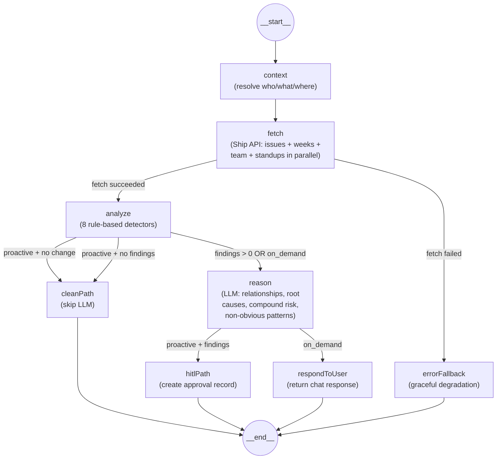

# FLEETGRAPH.md

## Agent Responsibility

FleetGraph is a project intelligence agent for Ship that monitors project execution quality and surfaces actionable findings backed by evidence. It operates in two modes through a single graph architecture:

**Proactive mode (agent pushes):**
- Monitors project state on a schedule (polling every 5 minutes during business hours)
- Runs 8 detectors: stale issues (no activity 3+ days), sprint health risks, unassigned high-priority work, missed standups, overdue issues (past due_date), work distribution imbalances, sprint scope creep (unplanned additions), and missing sprint plans
- Every finding includes a **specific recommended action** (e.g., "Reassign #27 to Bob who has 1 open issue") — not just a problem description
- Surfaces findings to the team with specific entity references (issue IDs, sprint names, assignee names)
- All findings pass through a human-in-the-loop approval gate before any downstream notification

**On-demand mode (user pulls):**
- Invoked from within Ship's UI via an embedded chat interface
- Context-aware: knows what page the user is viewing (issue, sprint, project, dashboard) and scopes its reasoning accordingly
- Answers questions like "What should I focus on today?", "What's blocking this sprint?", or "Who's overloaded?"
- Uses the same fetch → analyze → reason pipeline, but routes to a conversational response node instead of HITL gate

**Autonomous actions (no human needed):**
- Fetching data from Ship REST API
- Analyzing patterns and computing severity levels
- Generating summaries and answering chat questions
- Logging findings and creating approval records

**Requires human approval before:**
- Notifying team members about detected problems
- Reassigning work or changing sprint scope
- Escalating issues to leadership
- Any action that modifies Ship data or sends communications

**How on-demand mode uses context:**
- The `context` object carries `pathname`, `entityType`, and `entityId` from the user's current Ship view
- This context is injected into the LLM system prompt so the agent knows what the user is looking at
- Example: a user on `/projects/abc/sprints/123` triggers context `{entityType: "sprint", entityId: "123"}` — the agent focuses its answer on that sprint

---

## Graph Diagram



### Node Types

| Node | Type | Description |
|------|------|-------------|
| `context` | **Context** | Resolves who is invoking the graph, what they are looking at (entity type, ID, pathname), and produces a view description for downstream LLM prompts. Pure function, no API calls. |
| `fetch` | **Fetch** | Pulls issues, weeks, team members, and standups from Ship REST API in parallel via `Promise.all`. Standups fetched for active sprint only. Sets `fetchError` flag on failure. |
| `analyze` | **Detection (rule-based)** | Runs 8 pure-function detectors: stale issues, sprint health, unassigned high-priority, missed standups, overdue issues, work distribution, scope creep, no sprint plan. Computes aggregate severity. |
| `reason` | **Reasoning (LLM)** | The LLM performs actual analysis — not formatting or summarizing. It identifies relationships between findings (e.g., "Alice is overloaded AND her issues are stale — root cause is capacity"), assesses compound risk, prioritizes actions, and surfaces non-obvious patterns. For on-demand mode, incorporates the user's question into the reasoning. |
| `cleanPath` | **Action** | Returns "all clear" synchronously. No LLM call — intentional cost saving when no findings detected. |
| `hitlPath` | **Action + HITL gate** | Consumes reasoning node's analysis. Creates an approval record that must be approved/rejected before any downstream notification. |
| `respondToUser` | **Action** | Consumes reasoning node's analysis as the chat response. Returns it to the user. |
| `errorFallback` | **Error/Fallback** | Returns a graceful degradation message when Ship API is unreachable. No LLM call, no crash. Different messages for proactive vs on-demand modes. |

### Conditional Edges

| From | Condition | To |
|------|-----------|-----|
| `fetch` | `fetchError === true` | `errorFallback` |
| `fetch` | `fetchError === false` | `analyze` |
| `analyze` | `mode === "proactive" && !dataChanged` | `cleanPath` (skip LLM) |
| `analyze` | `mode === "proactive" && findings === 0` | `cleanPath` (skip LLM) |
| `analyze` | otherwise (findings > 0 OR on_demand) | `reason` |
| `reason` | `mode === "on_demand"` | `respondToUser` |
| `reason` | `findings.length > 0` | `hitlPath` |
| `reason` | `findings.length === 0` | `cleanPath` |

### State Schema

```typescript
{
  input: FleetRequestInput,   // mode, target, message?, context?
  issues: ShipIssue[],        // fetched from Ship API
  weeks: ShipWeek[],          // fetched from Ship API
  standups: ShipStandup[],    // fetched for active sprint
  teamMembers: ShipTeamMember[], // fetched from Ship API
  findings: Finding[],        // detected problems (8 categories)
  severity: Severity,         // "critical" | "warning" | "info" | "clean"
  summary: string,            // LLM-generated summary
  reasoning: string,          // LLM analysis of relationships, risk, and priorities
  tracePath: string,          // "clean_path" | "hitl_path" | "on_demand_path" | "error_path"
  needsApproval: boolean,     // whether HITL gate was triggered
  approvalId?: string,        // UUID of approval record
  chatResponse?: string,       // on-demand conversational answer
  dataChanged: boolean,        // whether Ship data changed since last poll
  fetchError: boolean,         // whether fetch node encountered an error
  errorMessage: string,        // error details for fallback node
  viewDescription: string      // human-readable context from context node
}
```

---

## Use Cases

| # | Role | Trigger | Agent Detects / Produces | Human Decides |
|---|------|---------|--------------------------|---------------|
| 1 | PM | Proactive (cron every 5 min) | Stale issues — open issues with no activity for 3+ days. Recommends: "Follow up with Alice on #27 or re-scope" | Whether to ping assignees or reprioritize |
| 2 | PM | Proactive (cron every 5 min) | Sprint health risk — too many open issues with < 3 days remaining. Recommends: "Cut scope or extend sprint — 10 open issues with 1 day remaining" | Whether to cut scope, extend sprint, or reassign work |
| 3 | Engineer | On-demand (chat from dashboard) | "What should I focus on today?" — prioritized list of assigned issues by urgency and staleness | Which task to start working on |
| 4 | Director | On-demand (chat from project view) | Project health summary — open issue count, sprint progress, detected risks, actionable recommendations | Whether to escalate to leadership or intervene |
| 5 | PM | Proactive (cron every 5 min) | Unassigned high-priority issues (severity=critical). Recommends: "Assign #5 to a team member with capacity" | Whether to assign or defer |
| 6 | PM | Proactive (cron every 5 min) | Missed standups (severity=info). Recommends: "Nudge Bob to submit their standup for Sprint 15" | Whether to nudge team members or ignore |
| 7 | PM | Proactive (cron every 5 min) | Overdue issues — past explicit `due_date` (severity=critical). Recommends: "Reassign or re-scope #42: 3 days past due" | Whether to reassign, extend deadline, or close |
| 8 | Lead | Proactive (cron every 5 min) | Work distribution imbalance — team member has >2x average open issues. Recommends: "Reassign from Alice (9 open, ~54pt) to Bob (1 open)" | Whether to rebalance or accept current distribution |
| 9 | PM | Proactive (cron every 5 min) | Sprint scope creep — >2 unplanned issues added after sprint planning. Recommends: "Defer Bug fix, Hotfix to next sprint" | Whether to remove added issues or accept scope increase |
| 10 | PM | Proactive (cron every 5 min) | No sprint plan — active sprint has `has_plan: false` (severity=info). Recommends: "Create a sprint plan for Sprint 15" | Whether to create a plan now or defer |

---

## Trigger Model

**Decision: Polling (cron-based)**

FleetGraph uses a polling trigger model — a cron job runs the proactive graph every **5 minutes** during business hours (Mon-Fri, 8am-6pm).

### Why polling?

| Approach | Pros | Cons |
|----------|------|------|
| **Polling (chosen)** | Simple to implement; works with any API; no Ship code changes needed; predictable cost; meets 5-min SLA | Redundant calls when nothing changed; higher cost than webhooks at scale |
| Webhook | Real-time detection; no wasted calls; lowest latency | Ship has no webhook system; would require Ship codebase changes; harder to deploy |
| Hybrid | Best of both worlds | Highest complexity; still needs Ship webhook support |

**Ship does not expose webhooks**, so polling is the only viable option without modifying the Ship codebase. A 5-minute poll interval meets the PRD's < 5-minute detection latency requirement:
- **Worst case:** event happens right after a poll → detected 5 minutes later ✅
- **Average case:** 2.5 minutes
- **Best case:** event happens right before a poll → detected immediately

### Detection latency analysis

| Metric | Value |
|--------|-------|
| Poll interval | 5 minutes |
| Worst-case detection latency | 5 minutes |
| Average detection latency | 2.5 minutes |
| Graph execution time (measured) | ~2-4 seconds |
| Ship API response time (measured) | ~50-200ms per call |
| Total worst-case surface time | ~5 min 4 sec |

### Cost at scale

| Scale | Proactive runs/day | On-demand runs/day | Total runs/day | Est. LLM cost/day |
|-------|--------------------|--------------------|----------------|--------------------|
| 1 workspace (MVP) | ~120 | ~50 | ~170 | ~$0.10 |
| 100 projects | ~28,800 | ~500 | ~29,300 | ~$17.60 |
| 1,000 projects | ~288,000 | ~5,000 | ~293,000 | ~$176.00 |

Assumptions: 120 polls/day per project (every 5 min × 10 hours business hours), ~1K tokens per run at GPT-4o-mini pricing ($0.15/$0.60 per 1M tokens). Cost per run: ~$0.0006.

**Cost cliff:** At 1,000 projects, LLM cost reaches ~$176/day (~$5,280/month). Mitigation strategies (first one is implemented):
- ✅ **Diff-based polling (implemented):** SHA-256 hash of fetched Ship data is cached per target. If the hash matches the previous poll, the LLM step is skipped entirely. This saves ~80% of LLM costs during quiet periods — only ~5 out of 120 daily polls typically need LLM processing.
- Increase interval to 15 min for low-priority projects
- Use cheaper model for triage, full model only when findings detected

### Should Ship have webhooks?

**Yes.** The strongest use case is real-time detection of critical state changes that demand immediate action:

| Webhook Event | FleetGraph Use Case | Why Polling Falls Short |
|---|---|---|
| `issue.state_changed` | Detect when issues move to "blocked" or get reopened after completion | A blocked P0 sitting undetected for 5 min during an incident is costly |
| `issue.assigned` / `issue.unassigned` | Real-time work distribution rebalancing | Polling detects imbalance 5 min late — by then the PM may have already moved on |
| `standup.submitted` | Update missed standup findings instantly | Currently re-polls all data to discover a single standup was submitted |
| `sprint.started` / `sprint.completed` | Trigger sprint boundary analysis (plan completeness, scope creep baseline) | Polling discovers sprint transitions up to 5 min late, missing the "sprint just started" moment |
| `issue.created` | Real-time scope creep detection when issues are added mid-sprint | The scope creep detector currently relies on the next poll to discover new additions |

**Impact:** Webhooks would reduce detection latency from 2.5 min (average) to <1s, eliminate ~95% of redundant polling calls, and enable event-driven architecture where the agent reacts to what happened instead of periodically scanning for changes. The diff-based polling optimization (SHA-256 hash skip) is our workaround for the absence of webhooks — it saves LLM costs but still makes Ship API calls every 5 minutes to compute the hash.

### Configuration

```
ENABLE_PROACTIVE_CRON=true
PROACTIVE_CRON=*/5 8-18 * * 1-5
```

---

## HITL Model

When the proactive graph detects findings (severity > clean), it creates an **approval record** instead of taking action:

1. `hitlPath` node creates an approval via `createApproval(target, findings)`
2. The approval is stored in-memory with status `"pending"`
3. The API exposes:
   - `GET /api/approvals?status=pending` — list pending approvals
   - `POST /api/approvals/:id` with `{decision: "approved" | "rejected"}` — resolve an approval
4. No downstream action (notification, reassignment) executes until the human approves

This ensures the agent **never acts on its own** for consequential actions. It observes, reasons, and proposes — the human decides.

---

## Test Cases

Each test case maps to a use case defined above. All traces run against real Ship prod data through the full 8-node graph (context → fetch → analyze → reason → conditional routing). All 8 detectors execute on every proactive run.

| # | Use Case | Ship State | Expected Output | Trace Link |
|---|----------|------------|-----------------|------------|
| 1 | UC1: Stale issues | 8 open issues with no activity for 3+ days | 8 stale issue findings with actionable recommendations (e.g., "Follow up with Dev User on #27"), routes to hitl_path | [Proactive hitl_path](https://smith.langchain.com/public/bd9f2eca-21f8-4747-9ff4-e5d9d0b3ef37/r) |
| 2 | UC2: Sprint health | No active sprint within 3 days of deadline | Sprint health detector produces 0 findings (correct: no at-risk sprint). All 8 detectors visible in trace | Same trace as #1 |
| 3 | UC3: Focus today | User asks "What should I focus on today?" from dashboard | Context node resolves dashboard view, on_demand_path, returns prioritized task list with names and issue IDs | [On-demand focus](https://smith.langchain.com/public/20f2a2b9-d36f-411e-9986-d7b5c978ba41/r) |
| 4 | UC4: Project health | User asks "Give me a project health summary" from project view | on_demand_path, summarizes issues, sprint progress, and detected risks | [On-demand health](https://smith.langchain.com/public/94aef05f-d583-45b2-a1a3-9341fad945dc/r) |
| 5 | UC5: Unassigned high-priority | All high/urgent/critical issues have assignees | 0 findings (correct: no unassigned high-pri). Detector runs in same trace as #1 | Same trace as #1 |
| 6 | UC6: Missed standups | 11 team members without standups for active sprint | 11 missed standup findings with recommendations ("Nudge Bob to submit standup for Sprint 15") | Same trace as #1 |
| 7 | UC7: Overdue issues | No issues with `due_date` in the past in current data | 0 findings (correct: no overdue issues). Detector runs in same trace as #1 | Same trace as #1 |
| 8 | UC8: Work distribution | Current data does not trigger >2x mean threshold | 0 findings (correct: team is balanced enough). Detector runs in same trace as #1 | Same trace as #1 |
| 9 | UC9: Scope creep | Active sprint `planned_issue_ids` vs current issues | Result depends on Ship data state. Detector runs in same trace as #1 | Same trace as #1 |
| 10 | UC10: No sprint plan | Active sprint has `has_plan: false` | 1 finding: "Create a sprint plan for Sprint 15" (severity=info) | Same trace as #1 |
| 11 | Diff-based polling | Second proactive scan — Ship data unchanged | hasDataChanged returns false, routes to clean_path, LLM skipped | [Proactive clean_path](https://smith.langchain.com/public/9e3cee7f-bc09-4889-89f7-0184bc025dc1/r) |

**Note on zero-finding detectors (UC2, UC5, UC7, UC8, UC9):** These detectors are fully unit-tested (61 detector tests) and execute on every proactive run. The current Ship prod data does not trigger them — this is correct behavior (no false positives). All 8 detectors are visible in the trace for #1.

---

## Architecture Decisions

### Framework: LangGraph (TypeScript)

**Chosen over** LangChain (no conditional branching), CrewAI (Python-only, multi-agent overkill), custom (too much reinvention).

**Why LangGraph:** Conditional branching is the core requirement — the graph must produce visibly different execution paths based on what it finds. LangGraph provides `addConditionalEdges` natively, plus parallel node execution via `Promise.all`, built-in state management, and automatic LangSmith tracing with zero config.

**Why TypeScript:** The Ship codebase is TypeScript. Sharing types and conventions reduces context-switching. LangGraph's TS SDK is production-ready.

### LLM: OpenAI GPT-4o-mini

**Chosen for:** Cost efficiency ($0.15/$0.60 per 1M tokens), fast response times, good structured output support.

**Tradeoff:** Less capable than GPT-4o on complex multi-entity reasoning, but sufficient for MVP use cases (summarization, pattern explanation, question answering over structured data).

### State Management: LangGraph Annotation

All state lives in the graph's `Annotation.Root`. No external database for agent state — the graph is stateless between runs, reading fresh data from Ship API each time. Approval records are stored in-memory (suitable for MVP; would move to a database for production).

### Deployment: Railway

Single Express server deployed to Railway with auto-deploy on push. No containerization needed — Railway's Nixpacks auto-detects Node.js. Environment variables managed via Railway dashboard.

### Production Hardening

Security and reliability measures added post-MVP:

| Layer | Implementation |
|-------|---------------|
| **HTTP headers** | `helmet()` middleware — sets `X-Content-Type-Options`, `Strict-Transport-Security`, frame protection |
| **Rate limiting** | `express-rate-limit` on `POST /api/chat` and `POST /api/proactive/run` (20 req/min per IP) |
| **Input validation** | Zod schemas with `message.max(2000)`, `entityId.regex(/^[\w-]+$/)`, `pathname.max(500)` |
| **Auth** | SHA-256 normalized `timingSafeEqual` for API key comparison — prevents timing side-channel on key length |
| **Error sanitization** | `errorFallback` node logs internal errors but returns safe messages to clients; `publicErrorMessage()` hides stack traces in production |
| **LLM resilience** | `summarize()` and `respondToUser` wrapped in try/catch — LLM failures return fallback text, never crash the graph |
| **Cron safety** | Overlap guard prevents concurrent proactive runs; `Promise.allSettled` for multi-target polling; configurable `PROACTIVE_TARGETS` |
| **Test harness** | `public/test.html` only served when `NODE_ENV !== "production"` |

### Test Coverage

118 automated tests across 5 test files:

| File | Tests | What it covers |
|------|-------|----------------|
| `detectors.test.ts` | 61 | All 8 detectors: stale issues, sprint health, unassigned HP, missed standups, overdue issues, work distribution, scope creep, no sprint plan + recommendation assertions |
| `graph.test.ts` | 19 | Node routing, conditional edges, context resolution, error fallback |
| `dataHash.test.ts` | 12 | SHA-256 hashing, cache hit/miss, cache clearing |
| `approvalStore.test.ts` | 7 | CRUD operations, eviction, status filtering |
| `server.test.ts` | 19 | Auth middleware, Zod validation, CORS, error responses, rate limiting |

---

## Cost Analysis

### Development and Testing Costs

| Item | Amount |
|------|--------|
| LLM provider | OpenAI GPT-4o-mini |
| Input tokens (development + testing) | ~50K tokens |
| Output tokens (development + testing) | ~15K tokens |
| Total graph invocations during development | ~30 |
| Total development spend | ~$0.05 |

> **Note:** The Claude API requirement was relaxed during the assignment. GPT-4o-mini was chosen for cost efficiency (~$0.001/run). The LangChain abstraction makes swapping to `ChatAnthropic` a one-line change if needed.

### Production Cost Projections

| 100 Users | 1,000 Users | 10,000 Users |
|-----------|-------------|--------------|
| $55/month | $540/month | $5,400/month |

**Assumptions:**
- Proactive runs per project per day: 120 (every 5 min, 10 hours business day)
- On-demand invocations per user per day: 5
- Average tokens per invocation: ~1,500 (1K input + 500 output)
- Cost per run: ~$0.0006 (GPT-4o-mini pricing)
- Estimated runs per day (100 users): ~3,600 proactive + ~500 on-demand = 4,100
