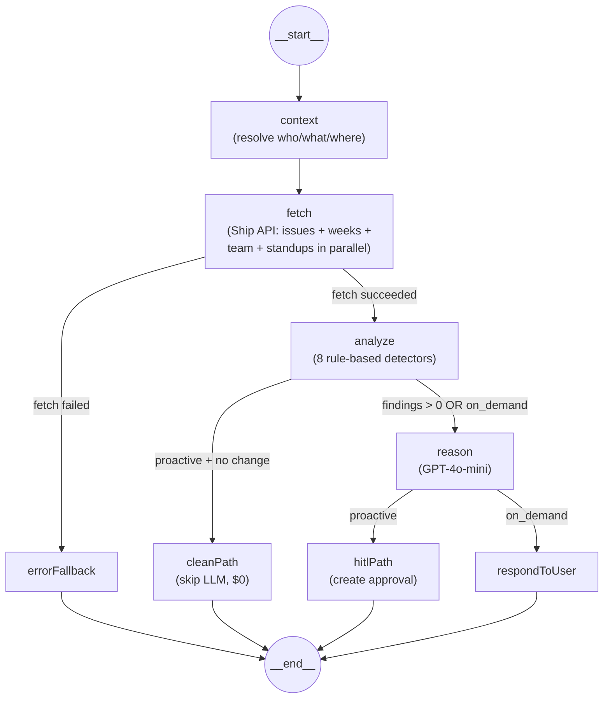

# FleetGraph

A Project Intelligence Agent for [Ship](https://ship-app-production.up.railway.app) — monitors project health proactively, answers questions on demand, and always waits for human approval before acting.

## Try It

### Embedded in Ship (production)

The full experience: FleetGraph embedded as a sidebar chat inside the Ship app, context-aware based on what page you're viewing.

> **URL:** https://ship-app-production.up.railway.app/login
>
> **Login:** `dev@ship.local` / `admin123` (admin) or any team member below
>
> After logging in, click the **⚡ lightning bolt icon** in the bottom-left sidebar to open FleetGraph.

| Role | Email | Password |
|------|-------|----------|
| **Admin (super-admin)** | `dev@ship.local` | `admin123` |
| Alice Chen | `alice.chen@ship.local` | `admin123` |
| Bob Martinez | `bob.martinez@ship.local` | `admin123` |
| Carol Williams | `carol.williams@ship.local` | `admin123` |
| David Kim | `david.kim@ship.local` | `admin123` |
| + 6 more team members | `{first}.{last}@ship.local` | `admin123` |

### Standalone Test Harness

Direct access to FleetGraph's API without Ship. Useful for testing proactive scans, viewing approvals, and running on-demand queries independently.

> **URL:** https://fleetgraph-production-89ba.up.railway.app/test.html

### LangSmith Traces

> [Proactive hitl_path (25 findings)](https://smith.langchain.com/public/acf00811-6b45-4d62-92d0-19f73b5a3f7b/r) · [On-demand focus](https://smith.langchain.com/public/a9e989d4-7192-48c6-8f36-647938df69fa/r) · [On-demand team](https://smith.langchain.com/public/bf50121e-a6c6-4ebb-bbc8-5fa747ddd94a/r) · [Diff-based skip](https://smith.langchain.com/public/3dfbafa7-f130-46ca-972c-34eee8fb678c/r)

---

## What It Does

Ship shows you what's happening. FleetGraph tells you what's wrong.

- **Proactive mode** — polls Ship every 5 minutes, detects stale issues and sprint health risks, surfaces findings through a human-in-the-loop approval queue
- **On-demand mode** — embedded chat answers questions like "What should I focus on today?" using real project data, scoped to whatever the user is viewing
- **Same graph, different paths** — both modes run through a single LangGraph architecture with conditional edges that produce visibly different execution traces

## Architecture



**Stack:** LangGraph (TypeScript) · OpenAI GPT-4o-mini · LangSmith tracing · Express · Railway
**8 detectors:** stale issues, sprint health, unassigned high-priority, missed standups, overdue issues, work distribution, scope creep, no sprint plan

## Quick Start

```bash
# 1. Clone and install
git clone https://github.com/robin-raq/fleetgraph.git
cd fleetgraph
npm install

# 2. Configure environment
cp .env.example .env
# Fill in: SHIP_API_TOKEN_PROD, OPENAI_API_KEY, LANGCHAIN_API_KEY

# 3. Run
npm run dev
```

Open http://localhost:8787 for the test harness.

## Environment Variables

| Variable | Required | Description |
|----------|----------|-------------|
| `SHIP_API_TOKEN_LOCAL` | Yes | Bearer token for local Ship instance |
| `SHIP_API_TOKEN_PROD` | Yes | Bearer token for Ship production |
| `OPENAI_API_KEY` | Yes | OpenAI API key for LLM reasoning |
| `LANGCHAIN_API_KEY` | Yes | LangSmith API key for tracing |
| `LANGCHAIN_PROJECT` | No | LangSmith project name (default: `FleetGraph-MVP`) |
| `FLEETGRAPH_API_KEY` | No | Optional auth key for FleetGraph API |
| `CORS_ORIGINS` | No | `*` or comma-separated frontend origin allowlist |
| `SHIP_API_TIMEOUT_MS` | No | Request timeout for Ship API calls (default: `8000`) |
| `ENABLE_PROACTIVE_CRON` | No | Set `true` to enable scheduled polling |
| `PROACTIVE_CRON` | No | Cron expression (default: `*/5 8-18 * * 1-5`) |
| `MAX_APPROVAL_RECORDS` | No | Cap for in-memory approval queue (default: `500`) |

## API Endpoints

| Method | Path | Description |
|--------|------|-------------|
| `GET` | `/health` | Health check |
| `GET` | `/` | Redirects to test harness |
| `POST` | `/api/chat` | On-demand chat (pass `message` + optional `context`) |
| `POST` | `/api/proactive/run` | Trigger a proactive scan |
| `GET` | `/api/approvals` | List approvals (filter with `?status=pending`) |
| `POST` | `/api/approvals/:id` | Approve or reject (`{decision: "approved"\|"rejected"}`) |

### Example: Proactive Scan

```bash
curl -X POST https://fleetgraph-production-89ba.up.railway.app/api/proactive/run \
  -H "Content-Type: application/json" \
  -d '{"target": "prod"}'
```

### Example: On-Demand Chat

```bash
curl -X POST https://fleetgraph-production-89ba.up.railway.app/api/chat \
  -H "Content-Type: application/json" \
  -d '{"target": "prod", "message": "What should I focus on today?"}'
```

## Testing

```bash
npm test           # full suite (detectors, graph, server, etc.)
npm run test:watch # watch mode
```

See **[VERIFICATION.md](./VERIFICATION.md)** for how reviewers verify detectors, graph paths, and LangSmith traces. API responses include a **`verification`** field (`context`, `graphSteps`, `langSmithHint`) plus **`findings[].detectionRule`** and **`recommendation`** on each finding.

## Project Structure

```
src/
├── server.ts          # Express API + cron setup
├── graph.ts           # LangGraph state graph (fetch → analyze → route)
├── detectors.ts       # Pure detection functions (stale issues, sprint health)
├── shipClient.ts      # Ship REST API client
├── approvalStore.ts   # In-memory HITL approval queue
├── config.ts          # Environment validation (Zod)
├── types.ts           # TypeScript interfaces
├── detectors.test.ts  # Detector unit tests
└── approvalStore.test.ts  # Approval store tests
public/
└── test.html          # Browser test harness
```

## Key Documents

| File | Purpose |
|------|---------|
| [FLEETGRAPH.md](./FLEETGRAPH.md) | Agent responsibility, use cases, graph diagram, trigger model, test cases, architecture decisions, cost analysis |
| [VERIFICATION.md](./VERIFICATION.md) | Detector matrix, test file mapping, LangSmith verification, API fields for reviewers |
| [PRESEARCH.md](./PRESEARCH.md) | Pre-search checklist — design decisions made before writing code |

## License

MIT
